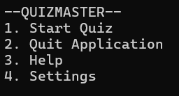
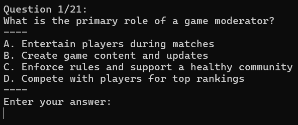

# Usage

There are several different instances where you will be required to interact with the program.

## Starting the quiz

Type `1` and press enter to start the quiz.

## Answering questions

To answer a question, type the letter that corrisponds to your chosen answer, and press enter.

## Settings

To change the settings, press `4` on the main menu.

This menu allows you to list the questions, and add new ones.
To do this, select your desired option by typing its number, and pressing enter, and then following the on screen prompts.

:::tip

Whenever you enter text, press enter to confirm.

:::